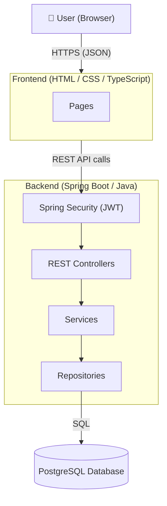
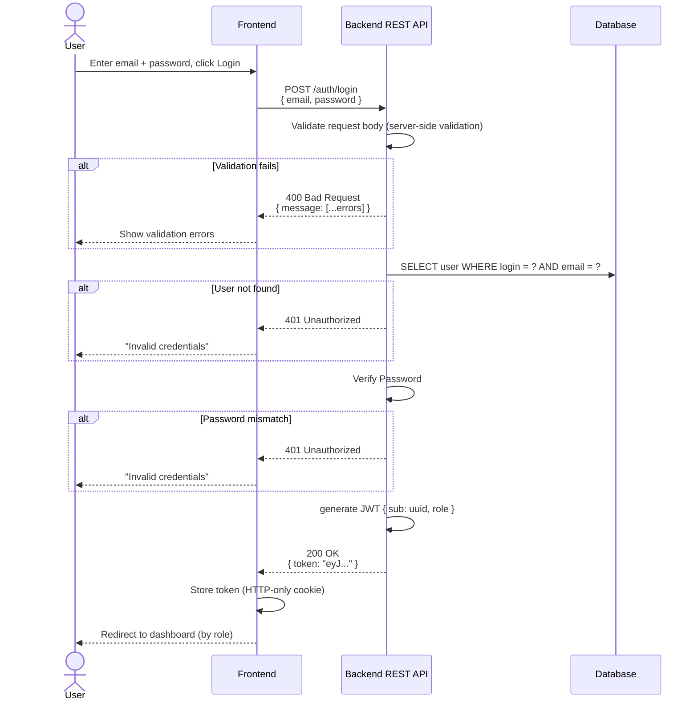
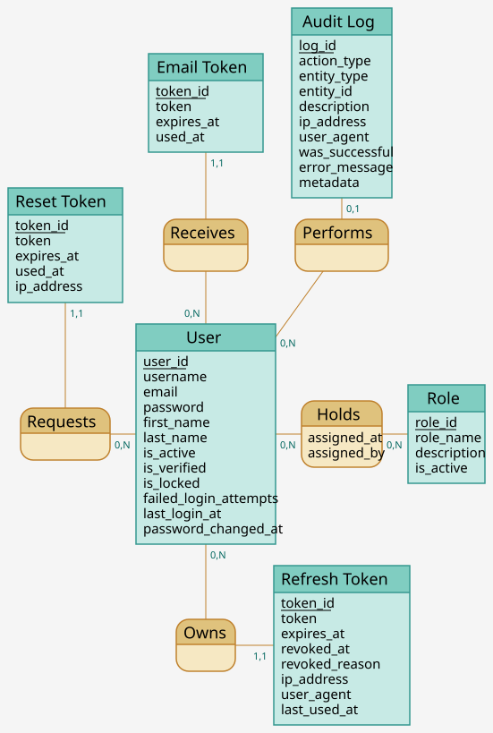
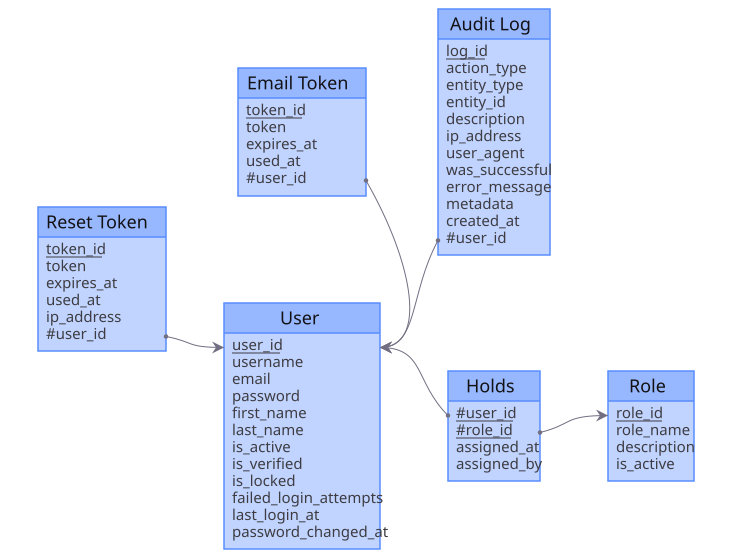
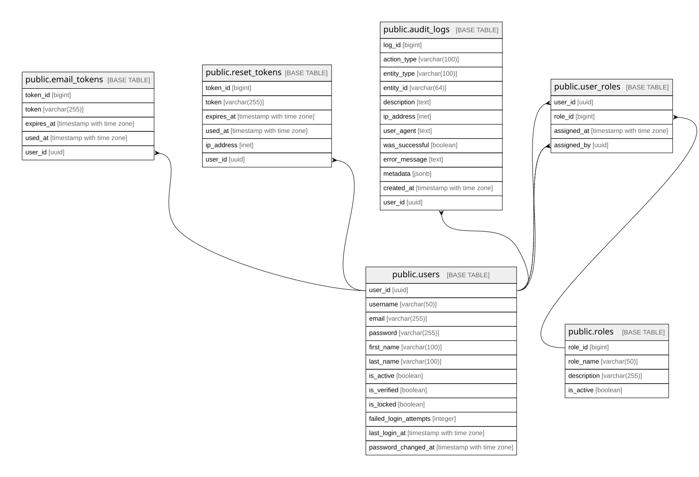
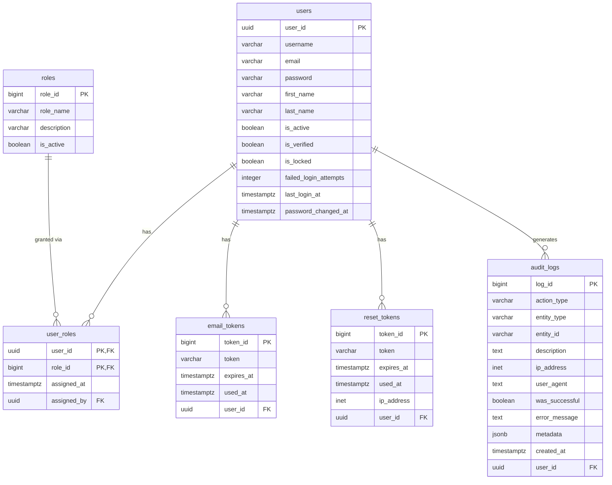
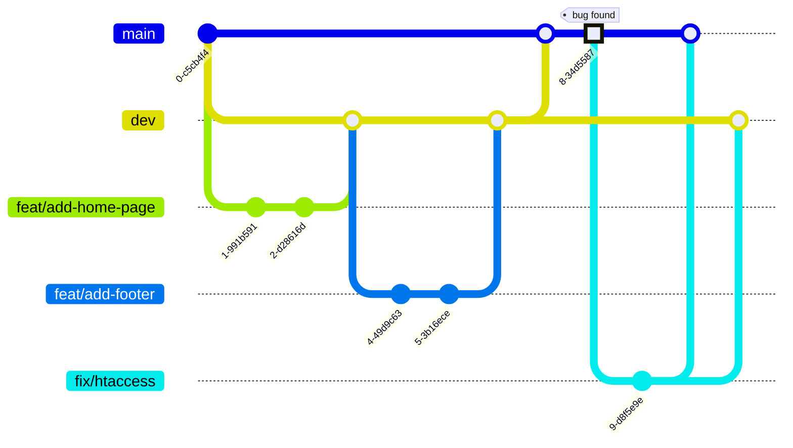

# Contributing to Learn-dev


## Welcome

Thank you for your interest in contributing to **learn-dev**, a learning platform to teach programming.

Whether you're fixing a bug, proposing a new feature, improving documentation,
or writing tests, every contribution helps make this project better.
This guide will walk you through the process of contributing.

If you have any questions, feel free to
[open an issue](https://github.com/ebouchut/learn-dev/issues) on GitHub.


## Before You Start

This page is quite long, so use the **hamburger menu**
to **navigate** the **table of contents** more easily.  
You can find it at the top right of the page (see below).


### Code of Conduct

Make sure you read and agree to our [Code of Conduct](CODE_OF_CONDUCT.md).

### Prerequisites for Development

Read the [Prerequisites section of the README](README.md#prerequisites).

### Understanding the Codebase

#### Code Documentation

The code reference documentation is not yet available and will be added to this repository in a future update.

#### Architecture Decision Records (ADR)

Significant Architectural and design Decisions are Recorded as **ADRs** under
[`docs/adr/`](docs/adr/), as Markdown files using the **[MADR](https://adr.github.io/madr/)** structure. 
ADRs are an append-only, numbered log: a decision is never rewritten.  
A new ADR supersedes an old one.   
Files are named `NNNN-short-title-in-kebab-case.md` (4-digit zero-padded sequence).

When creating an ADR use [`docs/adr/template.md`](docs/adr/template.md) as a template,
then add a link to the new ADR to the index in [`docs/adr/README.md`](docs/adr/README.md).

#### Architecture Overview

_learn-dev_ is a Web-based client-server application
using a PostgreSQL database to persist information.

##### System Architecture Diagram



##### User Login Sequence Diagram



#### MonoRepo

We use a **monorepo**, that is a Git repository containing mainly both the **frontend and** the **backend**.

**Using a monorepo offers the following advantages:**

- **Shared code and types:**  
  The *frontend* and *backend* can share types from a single source of truth, avoiding duplication and keeping them in sync.
- **Atomic changes:**  
  A single commit or PR can update the database schema, backend API, and frontend together, ensuring they stay compatible.
- **Easier code reviews:**  
  Reviewers can see the full picture of a change (database + backend + frontend) in a single PR rather than coordinating across multiple repositories.
- **Consistent tooling and configuration:**    
  Linting rules, formatting, CI/CD pipelines, and Git hooks are configured once and apply to all packages.

  
#### Directory Structure

```txt
learn-dev/
├── .gitignore
├── README.md
│
├── backend/                                              # Spring Boot application
│   ├── pom.xml                                           # Project’s dependencies, build configuration, and metadata
│   │
│   ├── src/
│   │   ├── main/
│   │   │   ├── java/dev/ericbouchut/learndev/
│   │   │   │   ├── LearnDevApplication.java              # Spring Boot entry point
│   │   │   │   │
│   │   │   │   ├── common/                               # Concerns shared across multiple features
│   │   │   │   │   ├── config/
│   │   │   │   │   │   ├── SecurityConfig.java           # Spring Security filter chain, CORS, CSRF
│   │   │   │   │   │   └── WebConfig.java                # Global web configuration
│   │   │   │   │   ├── dto/
│   │   │   │   │   │   └── ApiErrorResponse.java         # Standardized error response body
│   │   │   │   │   └── exception/
│   │   │   │   │       ├── GlobalExceptionHandler.java   # @RestControllerAdvice for centralized error handling
│   │   │   │   │       └── ResourceNotFoundException.java
│   │   │   │   │
│   │   │   │   ├── auth/                                 # Authentication and token management
│   │   │   │   │   ├── AuthController.java               # /api/auth endpoints (login, register, refresh)
│   │   │   │   │   ├── AuthService.java
│   │   │   │   │   ├── CustomUserDetailsService.java     # Loads user from DB for Spring Security
│   │   │   │   │   ├── dto/
│   │   │   │   │   │   ├── LoginRequest.java
│   │   │   │   │   │   ├── RegisterRequest.java
│   │   │   │   │   │   └── AuthResponse.java
│   │   │   │   │   ├── entity/
│   │   │   │   │   │   ├── EmailVerificationToken.java
│   │   │   │   │   │   ├── PasswordResetToken.java
│   │   │   │   │   │   └── RefreshToken.java
│   │   │   │   │   ├── repository/
│   │   │   │   │   │   ├── EmailVerificationTokenRepository.java
│   │   │   │   │   │   ├── PasswordResetTokenRepository.java
│   │   │   │   │   │   └── RefreshTokenRepository.java
│   │   │   │   │   └── exception/
│   │   │   │   │       ├── InvalidCredentialsException.java
│   │   │   │   │       └── TokenExpiredException.java
│   │   │   │   │
│   │   │   │   ├── user/                                 # User profile and account management
│   │   │   │   │   ├── UserController.java               # /api/users endpoints (CRUD, profile)
│   │   │   │   │   ├── UserService.java
│   │   │   │   │   ├── entity/
│   │   │   │   │   │   └── User.java                     # Maps to the users table
│   │   │   │   │   ├── repository/
│   │   │   │   │   │   └── UserRepository.java
│   │   │   │   │   ├── dto/
│   │   │   │   │   │   ├── UserResponse.java             # Outbound DTO (never exposes password hash)
│   │   │   │   │   │   └── UpdateUserRequest.java
│   │   │   │   │   └── exception/
│   │   │   │   │       ├── UserNotFoundException.java
│   │   │   │   │       ├── DuplicateEmailException.java
│   │   │   │   │       └── AccountLockedException.java
│   │   │   │   │
│   │   │   │   ├── role/                                 # Role and permission management
│   │   │   │   │   ├── RoleController.java               # /api/roles endpoints (admin only)
│   │   │   │   │   ├── RoleService.java
│   │   │   │   │   ├── entity/
│   │   │   │   │   │   ├── Role.java                     # Maps to the roles table
│   │   │   │   │   │   └── UserRole.java                 # Maps to the user_roles junction table
│   │   │   │   │   ├── repository/
│   │   │   │   │   │   ├── RoleRepository.java
│   │   │   │   │   │   └── UserRoleRepository.java
│   │   │   │   │   └── dto/
│   │   │   │   │       ├── RoleResponse.java
│   │   │   │   │       └── AssignRoleRequest.java
│   │   │   │   │
│   │   │   │   └── audit/                                # Security audit trail
│   │   │   │       ├── AuditService.java                 # Internal use only (no controller)
│   │   │   │       ├── entity/
│   │   │   │       │   └── AuditLog.java                 # Maps to the audit_logs table
│   │   │   │       └── repository/
│   │   │   │           └── AuditLogRepository.java
│   │   │   │
│   │   │   └── resources/
│   │   │       ├── application.yaml                      # Main config (active profile, app name)
│   │   │       ├── application-dev.yml                   # Dev profile (local DB, debug logging)
│   │   │       ├── application-prod.yml                  # Prod profile (external DB, stricter security)
│   │   │       └── db/
│   │   │           └── changelog/                        # Liquibase migration files (when introduced)
│   │   │               ├── db.changelog-master.yaml
│   │   │               ├── changes/
│   │   │                   └── V20260608161836-create-users-table.sql # Database migration file
│   │   │
│   │   │
│   │   └── test/
│   │       └── java/dev/ericbouchut/learndev/
│   │           ├── LearnDevApplicationTests.java         # Context load smoke test
│   │           │
│   │           ├── auth/
│   │           │   ├── AuthControllerTest.java           # @WebMvcTest for auth endpoints
│   │           │   └── AuthServiceTest.java
│   │           │
│   │           ├── user/
│   │           │   ├── UserControllerTest.java
│   │           │   ├── UserServiceTest.java
│   │           │   └── UserRepositoryTest.java           # @DataJpaTest with Testcontainers
│   │           │
│   │           ├── role/
│   │           │   ├── RoleServiceTest.java
│   │           │   └── RoleRepositoryTest.java
│   │           │
│   │           └── audit/
│   │               └── AuditServiceTest.java
│    
│    
├── docker/                         # Docker scripts
│   └── init/
│       └── 01-create-app-user.sh   # Runs once on first postgres:17 container start to create application database and user 
└── postman/                        # Contains the Postman requests to test the REST endpoints
    ├── learndev.environment.json   # Postman environment file with placeholders (adjust to your local config.) 
    └── learndev.collection.json    # Collection of Postman requests, with folders per feature  
```

The table below explains what each folder entails.

| Folder                                     | Purpose                                                                                  |
|--------------------------------------------|------------------------------------------------------------------------------------------|
| `backend/src/main/java/…/learndev/`        | Spring Boot application root — entry point and top-level package                         |
| `backend/src/main/java/…/learndev/common/` | Cross-cutting concerns: security config, global error handling, shared DTOs              |
| `backend/src/main/java/…/learndev/auth/`   | Authentication and token management (login, register, JWT, refresh)                      |
| `backend/src/main/java/…/learndev/user/`   | User profile and account management                                                      |
| `backend/src/main/java/…/learndev/role/`   | Role and permission management                                                           |
| `backend/src/main/java/…/learndev/audit/`  | Security audit trail (internal use — no public controller)                               |

#### Feature-based Package Layout

 
The project uses a **feature-based layout** for **packages**,
as you can see in the directory structure above,

The main advantages in my opinion are:
- **Navigability**:     
  When you open one package (such as `user`),
  you see all the classes related to the *user feature*. 
- **Encapsulation**  
  In **layer-based**, every class must be `public` 
  because the `controller` package needs to reach the `service` package, 
  which needs the `repository` package.   
  In **feature-based**, the controller, service, and repository 
  are in the same package, so you can use package-private 
  visibility to hide internals. 
  Only the few classes that genuinely cross feature boundaries need to be `public`.

> [!NOTE]
> Each **backend feature package** (e.g. `auth`, `user`, `role`...) follows the same layout.  
> A feature package contains the controller and service classes, 
> and the following sub-packages `entity`,`repository`, `dto`, and `exception`.


#### File Naming Convention

- Folder: [snake_case](https://en.wikipedia.org/wiki/Snake_case)
- Files
    - **Backend**
      - **[PascalCase](http://c2.com/cgi/wiki?PascalCase)**: Classes use _PascalCase_ and are suffixed by their 
        layer role: `CourseController`, `CourseService`, `Course`, `CourseRepository`, `CourseResponse`:   
        - **Configuration** classes end with `Config`. 
        - **Exception** classes end with `Exception`. 
        - **Entity** classes have no suffix (they represent the domain noun directly) (e.g., `Course`).
          An entity represents a database table as a Java object.
          It defines what the data looks like: which fields exist, their types, their constraints.    
          For example, `Course.java` maps to your `courses` table and contains fields like `name`, `description`.
        - **Repository** classes define how you access data such as finding a course by name, 
          saving a new course, deleting a course. For example, `CourseRepository.java` may provide methods 
          such as `findByName(String name)` or `save(Course course)`.
        - **Service** classes contains business logic.
        - **DTO** data transfer classes carry data between layers or across the API boundary.
          They decouple the API's input/output shapes from the database entities
          and prevent sensitive fields (e.g. password hash) from leaking into responses.
        - **Controller**: Spring `@RestController`s that maps HTTP requests to handler methods.
          They delegate business logic to the service layer and returns the appropriate
          HTTP response and status code.
        - ...
      - Multi-part-naming for files in a feature folder: **`name.type.extension`**, contains 3 segments, where:
          - `name` may refer to a feature, middleware, service,
          - `type` refers to the type: `routes`, `controller`, `validation` (JSON validation),
            `service` (handles business logic),
            `middleware` (intercepts requests before the handler — e.g., auth, logging),
            `client` (adapter for an external service)
          - `extension` refers to the file extension such as `ts`

    
> [!NOTE]
> **What are `PascalCase`, `snake_case`, and `camelCase`?**
>
> - **[PascalCase](http://c2.com/cgi/wiki?PascalCase)** is a naming convention where the first letter of every word
>   is capitalized, with no spaces or underscores between words,  
>   e.g.: **`LearnDevApplication`**
> - **[snake_case](https://en.wikipedia.org/wiki/Snake_case)** 
>   is a naming convention where words are lowercase and separated 
>   with underscores (`_`),   
>   e.g.: **`learn_dev_application`**
> - **[camelCase](https://wiki.c2.com/?CamelCase)** is a naming convention 
>   where the first word starts with a lowercase letter and each subsequent 
>   word begins with an uppercase letter, with no spaces or underscores,    
>   e.g.: **`learnDevApplication`**


#### URL / Routing Conventions

- **Authentication endpoints are grouped under the `/auth/` prefix**:
  `/auth/login`, `/auth/register`, `/auth/logout` (and future `/auth/reset-password`).
  This centralizes everything related to authentication and mirrors the
  feature-based package layout (the `auth` package owns `/auth/**`).
- **Application pages stay at the root or under their own feature prefix**
  (for example `/dashboard`, `/courses/**`), not under `/auth/`, since they are
  not authentication actions.


#### Database

The *learn-dev* platform uses a **[PostgreSQL](https://www.postgresql.org/)** relational database to persist entities.


#### Database Migrations (Liquibase)

We use **[Liquibase](https://www.liquibase.com/)** to manage the database schema.  
Migrations live in `src/main/resources/db/changelog/`.    
Liquibase uses:

- **`src/main/resources/db/changelog/db.changelog-master.yaml`**:  
  a **configuration file** that defines the format and the order of migrations to apply.
  It lists every change file via `includeAll` on the `changes/` directory (applied in filename order).
- `changes/VYYYYMMDDHHMMSS-short-description.sql`  
  a **migration file** (called **change file**) to apply.  
  Each change file contains a pair of directives (specially crafted SQL comments):
  the changeset to apply to the database structure and how to roll it back.
  It contains DDL (Data Definition Language) **SQL**. 
and are named with a timestamp prefix:

- The Change files have a naming convention of:  
  ```
  VYYYYMMDDHHMMSS-short-description.sql
  ```
  e.g. `V20260608161842-create-idx-user-roles-role-id.sql`.  

`V` + UTC timestamp keeps files ordered chronologically 
and avoids numbering collisions  when branches add migrations in parallel.


**Example:**  `src/main/resources/db/changelog/changes/V20260608161836-add-users.sql`

```sql
--liquibase formatted sql

-- users: application accounts. UUID PK — non-enumerable and future-API-safe (ADR-0003).
--changeset ebouchut:V20260608161836
CREATE TABLE users (
    user_id               UUID         PRIMARY KEY DEFAULT gen_random_uuid(),
    username              VARCHAR(50)  NOT NULL UNIQUE,
    email                 VARCHAR(255) NOT NULL UNIQUE,
    password              VARCHAR(255) NOT NULL,          -- bcrypt/argon2 hash, never plaintext
    first_name            VARCHAR(100),
    last_name             VARCHAR(100),
    is_active             BOOLEAN      NOT NULL DEFAULT TRUE,
    is_verified           BOOLEAN      NOT NULL DEFAULT FALSE,
    is_locked             BOOLEAN      NOT NULL DEFAULT FALSE,
    failed_login_attempts INTEGER      NOT NULL DEFAULT 0,
    last_login_at         TIMESTAMPTZ,
    password_changed_at   TIMESTAMPTZ
);
--rollback DROP TABLE users;
```

Where:
- **`--liquibase formatted sql`**  
  This special SQL comment indicates that this file is a Liquibase migration in SQL format.
- **`--changeset ebouchut:V20260608161836`**  
  This comment should be located **before** the SQL changeset to update the database structure 
  (here add the `users`table). It contains : `author:id`.
- **`--rollback DROP TABLE users;`**  
  this SQL statement to rollback the change should be prefixed with `--rollback ` (on the same line). 


> [!IMPORTANT]
> - Each file should contain **a single changeset per file** prefixed with
>   `--changeset author:id`
> - The **changeset id equals the filename's timestamp**, e.g.
    >  `--changeset ebouchut:V20260608161842`. This keeps the id globally unique.
> - Migrations are **append-only**: never edit a changeset that has already run on
>   a shared database — add a new one. 
> - Each changeset should have a `--rollback` section.
> - After adding or removing a column, update the MCD diagram source
    (`docs/database/merise/learn-dev.mcd`) to match, then run
>   ```shell
>   make check-schema-drift && make diagrams
>   ```
>   `scheck-schema-drift` verifies every table column is represented in the
diagram.  [CI](.github/workflows/schema-drift.yml) runs this check too.


#### Database Naming Conventions

Here are the naming conventions for the **name** of our database **tables**:

- All lowercase
- Plural
- Use underscore for multi words names: `social_networks`
- Less than 64 characters (remnant of a MySQL constraint, just in case ;-)

Do not use an underscore as the first character.


#### Database Schema

This section describes the data model using the progressive 3 diagrams
(MCD, MLD, and MPD) from the Merise methodology.
This gives a view from high-level conceptual model (MCD), logical model (MLD) to 
physical model (MPD) with all the database details.


##### MCD Diagram

*MCD* stands for 🇫🇷 **Modèle Conceptuel de Données** (Conceptual Data Model).
The *MCD diagram* is part of the *Merise* methodology and shows the entities 
and relationships without the (database) technical details.

It is a high-level **business-domain** oriented diagram  
that shows the **data (entities)**, their **relationships** and **cardinalities**,
with **NO technical and implementation details**.

> 


##### MLD Diagram

*MLD* stands for 🇫🇷 **Modèle Logique de Données** (Logical Data Model).
The **MLD diagram** is part of the _Merise_ methodology and shows 
the *Logical Data Model*.

It shows the relational structure in a database-agnostic way.
It is a transformed version of the MCD where:
- entities become tables, 
- `1..N` relationships become foreign keys,
- `N..N` relationships become junction tables,
- `1..1` relationships become foreign keys.      

The *MLD* is shared with domain experts and application developers.  
*Domain experts* can verify that the relational structure accurately reflects 
the business.       
*Application developers* can then start creating the entities.

> 

> [!NOTE]
> **Regenerating the MLD:** the single source of truth is the conceptual MCD
> (`learn-dev.mcd`). Run `make mld`: it auto-derives the logical model
> (`learn-dev_mld.mcd`, via mocodo's `-t diagram`), emits the relational schema
> as Markdown (`learn-dev_mld.md`, via `-t mld`), and renders the diagram
> (`learn-dev_mld.svg`). The `learn-dev_mld.*` files are **generated artifacts —
> do not edit them by hand**; edit only `learn-dev.mcd`.


##### MPD Diagram

*MPD* stands for 🇫🇷*Modèle Physique des Données* (Physical Data Model).

This diagram is **exhaustive** and **database-specific**.  
It contains all the tables, fields, keys, database-specific data types,
and constraints.
It is aimed at database administrators and application developers:

- Developers use it to implement the data model in the app.  
- Database administrators use it to create the migration scripts.


> 

The **[full MPD documentation (in Markdown)](docs/database/merise/mpd/README.md)** 
contains what is missing from the above diagram due to space limitations.    
This is why the **SVG** and the **full MPD documentation) work together**.
Use the SVG to navigate and the Markdown to look up specifics:

- The **SVG** above gives a visual *overview* of every table, column, and foreign key relationship at a glance.
- The **Markdown** is the *exhaustive reference* (with all constraints).  
  For each table, `docs/database/merise/mpd/public.<table>.md` lists every column's type, default,
  and nullability, plus the full constraints (primary keys, foreign keys, and uniqueness)
  and indexes — details that a diagram cannot convey. 

> [!NOTE]
> The MPD is generated by [`tbls`](https://github.com/k1LoW/tbls) from the **live
PostgreSQL database** (not from the MCD), so it always reflects the real schema.    
Run `make mpd` to regenerate it.


##### ERD Diagram




> [!TIP]
> If you want to create an Entity Relationship Diagram (ERD) like this one,
> then take a look at [Mermaid.js](https://mermaid.js.org/intro/).
> With this syntax embedded in a Markdown file, GitHub issue,
> you can easily create many types of diagrams such as sequence/flow/class/state diagrams to only name a few.
>
> GitHub among many other [tools, IDEs and platforms support Mermaid diagrams](https://mermaid.js.org/ecosystem/integrations-community.html#community-integrations).
>
> To give Mermaid diagrams a whirl, you can use the [free online visual editor](https://mermaid.live/) to build your first diagram,
> share it with others and even export it to various formats.

> [!NOTE]
> This diagram uses [Crow's foot notation](https://mermaid.js.org/syntax/entityRelationshipDiagram.html#relationship-syntax)
> for the **cardinality of relationships**, where:
>
> - `o|` denotes `0..1` (zero or one)
> - `||` denotes Exactly one
> - `o{` denotes `0..n` (zero or more)


## How to Contribute

### Reporting Bugs

If you encounter a bug, please [open an issue](https://github.com/ebouchut/learn-dev/issues) and include:

- A clear and descriptive title.
- Steps to reproduce the problem (code snippets, commands, or screenshots if relevant).
- What you expected to happen.
- What actually happened (including any error messages).
- Your environment details (OS, browser, Node/Python/runtime versions, etc. if applicable).

This information helps maintainers reproduce and fix the issue more quickly.

### Suggesting Enhancements

We welcome ideas to improve **learn-dev** (new features, UX improvements, performance, documentation, etc.).
Before opening a feature request, please:

- Check the existing [issues](https://github.com/ebouchut/learn-dev/issues) to see if a similar idea already exists.
- Add a comment to an existing issue if it matches your idea, rather than opening a duplicate.

If you open a new enhancement issue, try to explain the problem you are trying to solve, not only the solution you have in mind.

#### Feature Request Template

When creating a feature request issue, you can use the following structure:

- **Summary**: A short description of the feature.
- **Problem**: What problem does this feature solve for users?
- **Proposed solution**: How you think this feature could work (UI/API/behavior).
- **Alternatives**: Any alternative solutions or workarounds you have considered.
- **Additional context**: Screenshots, diagrams, or links that help explain the idea.

### Finding Issues to Work on (good first issue, help wanted)

If you are new to the project, we recommend starting with issues labeled
[`good first issue`](https://github.com/ebouchut/learn-dev/labels/good%20first%20issue) or
[`help wanted`](https://github.com/ebouchut/learn-dev/labels/help%20wanted) on GitHub.

Steps to get started:

- Pick an open issue with one of these labels.
- Comment on the issue to indicate that you would like to work on it.
- Wait for a maintainer to confirm or provide additional guidance before investing a lot of time.

If you are unsure where to start, you can also open an issue asking for pointers or clarification.

## Development Workflow

### Setting Up Your Development Environment

At a high level, you will usually need to:

- Fork the repository and clone your fork locally.
- Follow the setup instructions in the project’s README files (for backend, frontend, or other components).
- Install the required dependencies using the package manager(s) mentioned there.
- Run the test suite or basic checks to ensure everything works before you start making changes.

For more detailed, component-specific instructions, please refer to the corresponding README files in each subdirectory.

### Testing the API with Postman

The repository ships two files under `backend/postman/` that let you
send requests to the backend API directly from [Postman](https://www.postman.com/):

| File                       | Purpose |
|----------------------------|---|
| `learndev.collection.json` | All API requests, grouped by feature |
| `learndev.environment.json`  | Variables with placeholder values (no real credentials) |


#### Import the Postman collection

1. Open Postman.
2. Click **`Collections`** / **`Import`**.
3. Select `backend/postman/learndev.collection.json`.

#### Import the Postman environment

1. Click **`Environments`** / **`Import`**.
2. Select `backend/postman/learndev.environment.json`.
3. Select **learnDev – Local** as the active environment (top-right dropdown).

#### Configure the Postman Collection

Open the **`learnDev – Local`** environment in Postman and fill in the fields marked as placeholders:

| Variable | What to set                                                         |
|---|---------------------------------------------------------------------|
| `baseUrl` | URL of your local backend server (default: `http://localhost:3000`) |

> [!WARNING]
> Never commit real credentials. The environment file intentionally ships
> with empty secret fields (`authToken`, `loginPassword`). Fill them in
> locally; Postman keeps them on your machine only.


#### Authenticate with Postman

Most endpoints require a JWT. To obtain one:

1. Run **`Auth`** / **`Login`** (`POST /auth/login`).
2. Copy the `token` value from the response body.
3. Paste it into the `authToken` environment variable.

All subsequent requests that require authentication read `{{authToken}}` from
the environment automatically.


### Git Branching Strategy

> [!NOTE]
> This project uses a very lightweight version of **[Git Flow](https://danielkummer.github.io/git-flow-cheatsheet/)**
> (without release branch) branching workflow to develop, integrate, release new features, and fix bugs.
>
> **Why did we make this change?**
>
> Usually, **`main`** is the default branch and serves both for the "integration" and deployment to production,
> which makes these processes brittle.
>
> **What is this change about?**
>
> To facilitate the integration of several features, we created the **`dev`** branch.  
> This is where we share the common code with the team.  
> It also serves as an integration branch to ensure that all the merged-in features work properly.
>
> This new branching scheme makes **`dev`** the new **default branch**.

We use a **monorepo**, meaning it contains both the **frontend and** the **backend**.



The **branches**:

- **`dev`** is the main development branch. 
    - The repository uses this branch as the primary one for development and Pull Requests.
    - It acts as an "integration" branch contains the common code and serves as a safety net.
    - This branch contains the code shared with the team.
    - This is the **default branch**, meaning it is the one we are on
      after cloning this repository, the **base branch** of our PRs.
    - It is also where we test that the merged features do not break the website.    
      Once we are confident the code on `dev` can be deployed to production, we merge `dev` into `main`.
    - We should not commit directly to `dev`, but create a PR (Pull Request) to bring in changes.
    - We have configured `dev` to require two approvals before merging to `dev`.
- **`main`** contains the production-ready code.
    - This is where the team merges `dev` after ensuring that the new features on `dev`
      are working properly together.
    - This branch is used for deployment.

You create **temporary branches** to develop a **feature** or **fix** a bug:

- **`feat/add-home-page`** denotes a feature branch.  
  The naming convention may seem a bit convoluted, but refer to:
    - the kind of branch it is: `feat` (this is a feature),
    - what the branch will bring when merged to `dev` such as `add-home-page`, a concise description of the feature,
      using all-lowercase words separated with an hyphen.
- **`fix/htaccess`** (or `fix/broken-link-page-footer`) are bug fix branches created when the website breaks in production.  
  They are branched off from `main`, then merged into `main` to fix the bug and then `dev` to backport the fix 
  to the main development branch.
  

> [!NOTE] 
> `dev` is the **base branch** of PRs.
> This is where GitHub merges the *head branch*, such as a 
> feature branch (`feat/add-home-page`) or a bugfix branch (`fix/broken-link-page-footer`). 
>
> ```mermaid
> ---
> title: GitHub PR branches
> config:
>   gitGraph:
>     showCommitLabel: false
>     mainBranchName: "dev (base branch)"
> ---
> gitGraph
>     commit
>     commit
>     branch   "feat/add-home-page (head branch)"
>     checkout "feat/add-home-page (head branch)"
>     commit
>     commit
>     checkout "dev (base branch)"
>     merge "feat/add-home-page (head branch)" type: HIGHLIGHT
> ```


### Git Commit Message Convention

This project follows the [Conventional Commits](https://www.conventionalcommits.org/en/v1.0.0/)
specification.

**Format:** `<type>(<scope>): <description>`

- `Type` — Nature of the change (required):

  | Type         | When to use                                                   |
  |--------------|---------------------------------------------------------------|
  | `feat`       | A new feature                                                 |
  | `fix`        | A bug fix                                                     |
  | `docs`       | Documentation-only changes                                    |
  | `style`      | Formatting or whitespace — no logic change                    |
  | `refactor`   | Code change that neither adds a feature nor fixes a bug       |
  | `test`       | Adding or correcting tests                                    |
  | `chore`      | Build process, tooling, or dependency updates                 |

- `Scope` — Optional area of the codebase in parentheses (e.g., `auth`, `README`, `git`).
- `Description` — Short imperative-mood summary, capitalized, no trailing period.

**Examples:**

```
feat(auth): Add JWT refresh token rotation
fix(user): Return 404 when user is not found
docs(README): Add prerequisites section
test(course): Cover edge case for empty course list
chore(git): Ignore IntelliJ IDEA configuration files
```


### Code Style and Formatting

: Document the code style and formatting


### Reset the Development Database

This section explains how to reset the **development** database.
It may prove useful when you need to start from a blank slate.

TODO: Add how to reset the development database

The command above:

1. Drops then recreates the database schema that is the structure (tables...),
1. Applies all database migrations to recreate the database changes in chronological order,
1. Runs a seed file to populate the database with development data.


### Apply the Latest Database Migrations

Once you have picked up the latest changes from the upstream `dev` branch,
you need to apply the latest database migrations as follows:

TODO: How to apply the latest database migrations in development


### Update the Database Schema

To add, remove, an entity or a field/property you need to update the database schema.
It serves as a source of truth used to generate and update the database.

Here is the **workflow** to add/update/remove the database structure (table, table column, relationship, enum value).

TODO: Explain how and where to update the database schema


### Add a Dependency

We use `Maven` as a packages/dependencies manager on the backend.


### Add a Backend Dependency

1. Search for the artifact on [Maven Central](https://central.sonatype.com/).
2. Copy the `<dependency>` snippet (select the **Maven** tab).
3. Paste it inside the `<dependencies>` block of `backend/pom.xml`:

   ```xml
   <dependency>
       <groupId>com.example</groupId>
       <artifactId>some-library</artifactId>
       <version>1.2.3</version>
   </dependency>
   ```

   Omit `<version>` when the dependency is already managed by the Spring Boot
   parent POM (e.g., `spring-boot-starter-*`, `jackson-databind`).

4. Save `pom.xml`. Maven downloads the artifact automatically on the next build
   or IDE sync.

5. Verify the dependency resolves correctly:

   ```shell
   mvn dependency:resolve
   ```


### Writing Tests

TODO: Explain how to write tests, what naming convention and best practices

#### Test Naming Conventions

- The file name of a test class should end in `Test`.
  Although this is counterintuitive and the opposite of the standard Java
  method naming convention, it makes the test output easier to read.


### Running Tests

Repository and integration tests run against a **real PostgreSQL** started by
[Testcontainers](https://testcontainers.com/) (see ADR-0006), so a container
engine must be running. This project uses **Podman**.

#### Run All Tests

The simplest way is to use ` make test`, which configures *Testcontainers* for
*Podman* automatically:

```bash
make test
```

It is equivalent to `./mvnw test` plus the Podman wiring described below.

#### Podman setup for Testcontainers

*Testcontainers* looks for a _Docker_ socket at `/var/run/docker.sock`, 
which does not exist under _Podman_. 

The workaround is to define two environment variables:

```bash
# Point Testcontainers at the Podman socket (resolved dynamically):
export DOCKER_HOST="unix://$(podman machine inspect --format '{{.ConnectionInfo.PodmanSocket.Path}}')"

# Ryuk (the Testcontainers reaper) misbehaves under rootless Podman, so disable it:
export TESTCONTAINERS_RYUK_DISABLED=true
```

Add these to your shell profile (for example `~/.zshrc`), 
source it, then run `./mvnw test` directly, or just use `make test`, 
which sets them for you.   
Make sure the Podman machine is started first: `podman machine start`.

On real Docker (for example in CI) neither variable is needed; `make test`
falls back to a plain `./mvnw test`.


### Generating the Documentation

TODO: Explain how to generate the documentation


### Running the CI Locally


## Submitting Changes

### Creating a Pull Request

### Pull Request Checklist

### Review Process and Timeline


## Release Process
