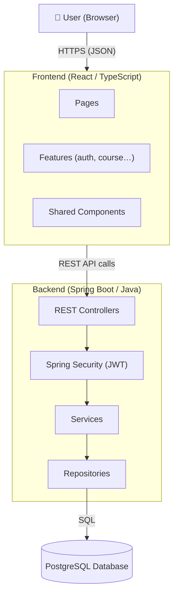
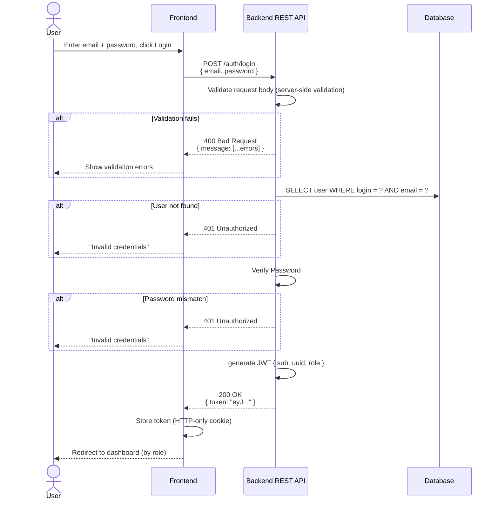
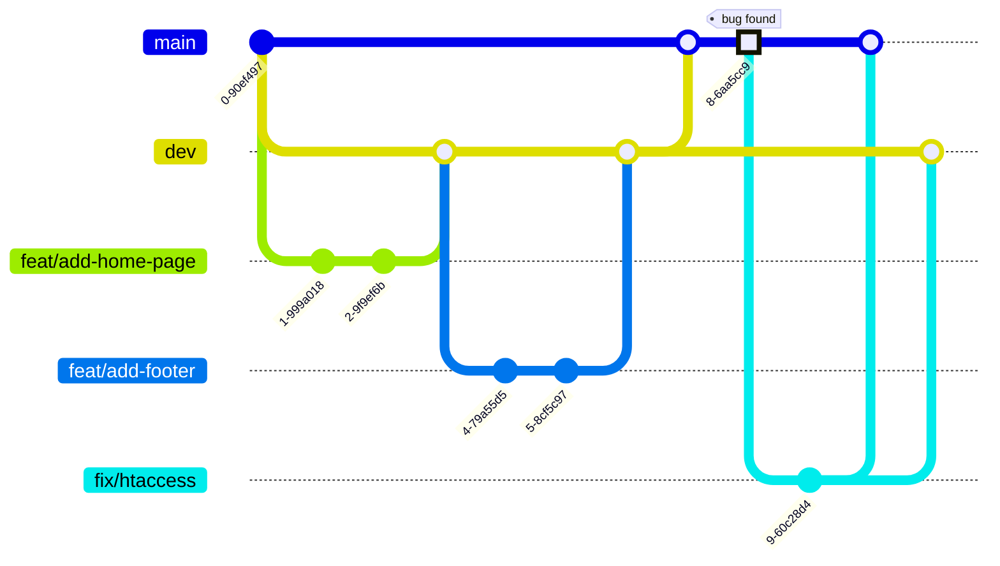

# Contributing to Learn-dev


## Welcome

Thank you for your interest in contributing to **learn-dev**, a learning platform
that uses hands-on practice, automated assessment and real-time feedback to teach programming.

Whether you're fixing a bug, proposing a new feature, improving documentation,
or writing tests, every contribution helps make this project better.
This guide will walk you through the process of contributing.

If you have any questions, feel free to
[open an issue](https://github.com/ebouchut/learn-dev/issues) on GitHub.


## Before You Start

This page is quite long, so use the **hamburger menu**
to **navigate** the **table of contents** more easily.  
You can find it at the top right of the page (see below).


### Code of Conduct

Make sure you read and agree to our [Code of Conduct](CODE_OF_CONDUCT.md).

### Prerequisites for Development

Read the [Prerequisites section of the README](README.md#prerequisites).

### Understanding the Codebase

#### Code Documentation

The code reference documentation is not yet available and will be added to this repository in a future update.

#### Architecture Overview

_learn-dev_ is a Web-based client-server application
using a PostgreSQL database to persist information.

##### System Architecture Diagram



##### User Login Sequence Diagram



#### MonoRepo

We use a **monorepo**, that is a Git repository containing mainly both the **frontend and** the **backend**.

**Using a monorepo offers the following advantages:**

- **Shared code and types:**  
  The *frontend* and *backend* can share types from a single source of truth, avoiding duplication and keeping them in sync.
- **Atomic changes:**  
  A single commit or PR can update the database schema, backend API, and frontend together, ensuring they stay compatible.
- **Easier code reviews:**  
  Reviewers can see the full picture of a change (database + backend + frontend) in a single PR rather than coordinating across multiple repositories.
- **Consistent tooling and configuration:**    
  Linting rules, formatting, CI/CD pipelines, and Git hooks are configured once and apply to all packages.


#### Modules

The project is composed of 2 modules:

- **`backend`**:  Spring Boot app (in `backend/`) 
- **`frontend`**: React app (in `frontend`).  
  `frontend` depends on `backend`.   

The *frontend* uses the JS types from and generated by the backend 
out of the <abbr title="Data Transfer Object">DTO</abbr>s (such as `UserResponse` and `CourseResponse`).   
This nifty trick makes the backend the single source of truth.

#### Directory Structure

```txt
learn-dev/
├── .gitignore
├── README.md
│
├── backend/                                              # Spring Boot application
│   ├── pom.xml                                           # Project’s dependencies, build configuration, and metadata
│   │
│   ├── src/
│   │   ├── main/
│   │   │   ├── java/dev/ericbouchut/learndev/
│   │   │   │   ├── LearnDevApplication.java              # Spring Boot entry point
│   │   │   │   │
│   │   │   │   ├── common/                               # Concerns shared across multiple features
│   │   │   │   │   ├── config/
│   │   │   │   │   │   ├── SecurityConfig.java           # Spring Security filter chain, CORS, CSRF
│   │   │   │   │   │   └── WebConfig.java                # Global web configuration
│   │   │   │   │   ├── dto/
│   │   │   │   │   │   └── ApiErrorResponse.java         # Standardized error response body
│   │   │   │   │   └── exception/
│   │   │   │   │       ├── GlobalExceptionHandler.java   # @RestControllerAdvice for centralized error handling
│   │   │   │   │       └── ResourceNotFoundException.java
│   │   │   │   │
│   │   │   │   ├── auth/                                 # Authentication and token management
│   │   │   │   │   ├── AuthController.java               # /api/auth endpoints (login, register, refresh)
│   │   │   │   │   ├── AuthService.java
│   │   │   │   │   ├── CustomUserDetailsService.java     # Loads user from DB for Spring Security
│   │   │   │   │   ├── dto/
│   │   │   │   │   │   ├── LoginRequest.java
│   │   │   │   │   │   ├── RegisterRequest.java
│   │   │   │   │   │   └── AuthResponse.java
│   │   │   │   │   ├── entity/
│   │   │   │   │   │   ├── EmailVerificationToken.java
│   │   │   │   │   │   ├── PasswordResetToken.java
│   │   │   │   │   │   └── RefreshToken.java
│   │   │   │   │   ├── repository/
│   │   │   │   │   │   ├── EmailVerificationTokenRepository.java
│   │   │   │   │   │   ├── PasswordResetTokenRepository.java
│   │   │   │   │   │   └── RefreshTokenRepository.java
│   │   │   │   │   └── exception/
│   │   │   │   │       ├── InvalidCredentialsException.java
│   │   │   │   │       └── TokenExpiredException.java
│   │   │   │   │
│   │   │   │   ├── user/                                 # User profile and account management
│   │   │   │   │   ├── UserController.java               # /api/users endpoints (CRUD, profile)
│   │   │   │   │   ├── UserService.java
│   │   │   │   │   ├── entity/
│   │   │   │   │   │   └── User.java                     # Maps to the users table
│   │   │   │   │   ├── repository/
│   │   │   │   │   │   └── UserRepository.java
│   │   │   │   │   ├── dto/
│   │   │   │   │   │   ├── UserResponse.java             # Outbound DTO (never exposes password hash)
│   │   │   │   │   │   └── UpdateUserRequest.java
│   │   │   │   │   └── exception/
│   │   │   │   │       ├── UserNotFoundException.java
│   │   │   │   │       ├── DuplicateEmailException.java
│   │   │   │   │       └── AccountLockedException.java
│   │   │   │   │
│   │   │   │   ├── role/                                 # Role and permission management
│   │   │   │   │   ├── RoleController.java               # /api/roles endpoints (admin only)
│   │   │   │   │   ├── RoleService.java
│   │   │   │   │   ├── entity/
│   │   │   │   │   │   ├── Role.java                     # Maps to the roles table
│   │   │   │   │   │   └── UserRole.java                 # Maps to the user_roles junction table
│   │   │   │   │   ├── repository/
│   │   │   │   │   │   ├── RoleRepository.java
│   │   │   │   │   │   └── UserRoleRepository.java
│   │   │   │   │   └── dto/
│   │   │   │   │       ├── RoleResponse.java
│   │   │   │   │       └── AssignRoleRequest.java
│   │   │   │   │
│   │   │   │   └── audit/                                # Security audit trail
│   │   │   │       ├── AuditService.java                 # Internal use only (no controller)
│   │   │   │       ├── entity/
│   │   │   │       │   └── AuditLog.java                 # Maps to the audit_logs table
│   │   │   │       └── repository/
│   │   │   │           └── AuditLogRepository.java
│   │   │   │
│   │   │   └── resources/
│   │   │       ├── application.yml                       # Main config (active profile, app name)
│   │   │       ├── application-dev.yml                   # Dev profile (local DB, debug logging)
│   │   │       ├── application-prod.yml                  # Prod profile (external DB, stricter security)
│   │   │       └── db/
│   │   │           └── changelog/                        # Liquibase migration files (when introduced)
│   │   │               └── db.changelog-master.yaml
│   │   │
│   │   │
│   │   └── test/
│   │       └── java/dev/ericbouchut/learndev/
│   │           ├── LearnDevApplicationTests.java         # Context load smoke test
│   │           │
│   │           ├── auth/
│   │           │   ├── AuthControllerTest.java           # @WebMvcTest for auth endpoints
│   │           │   └── AuthServiceTest.java
│   │           │
│   │           ├── user/
│   │           │   ├── UserControllerTest.java
│   │           │   ├── UserServiceTest.java
│   │           │   └── UserRepositoryTest.java           # @DataJpaTest with Testcontainers
│   │           │
│   │           ├── role/
│   │           │   ├── RoleServiceTest.java
│   │           │   └── RoleRepositoryTest.java
│   │           │
│   │           └── audit/
│   │               └── AuditServiceTest.java
│   │ 
│   │ 
│   └── postman/                            # Contains the Postman requests to test the REST endpoints
│       ├── learndev.environment.json       # Postman environment file with placeholders (adjust to your local config.) 
│       └── learndev.collection.json        # Collection of Postman requests, with folders per feature  
│   
│   
└── frontend/                               # React frontend
    ├── package.json                        # Project’s dependencies, scripts, and metadata
    ├── .env.example
    ├── index.html                          # Vite's HTML entry point
    ├── vite.config.ts
    ├── tailwind.config.ts
    ├── tsconfig.json
    ├── package-lock.json                   # Locks down exact dependency versions for reproducible installs
    ├── public/                             # Static assets served as-is by Vite
    │   └── favicon.ico
    └── src/
        ├── main.tsx                        # Vite entry point, mounts the React app
        ├── index.css                       # Tailwind directives
        ├── App.tsx                         # Root component, sets up routing
        │
        ├── components/                     # Generic, domain-agnostic UI components (primitives)
        │   ├── Button.tsx
        │   ├── Modal.tsx
        │   └── Spinner.tsx
        │
        ├── shared/                         # Domain-aware components used across features
        │   ├── User.tsx                    # Domain-aware component that wraps YouTubeEmbed
        │   └── UserAvatar.tsx
        │
        ├── pages/                          # Thin routing shells only that assemble features
        │   ├── HomePage.tsx
        │   ├── LoginPage.tsx
        │   ├── JuryDashboardPage.tsx
        │   └── AdminDashboardPage.tsx
        │
        └── features/                       # Feature-based modules (auth, course...), each self-contained
            │
            ├── auth/                       # Login, registration, JWT token management
            │   ├── components/             # React components that belong exclusively to THIS feature 
            │   │   ├── LoginForm.tsx
            │   │   └── RegisterForm.tsx
            │   ├── hooks/                  # Custom React hooks that manage state and behavior for this feature 
            │   │   └── useAuth.ts          # Manage what happens when the user interacts with the UI (logic but no JSX). 
            │   ├── api/                    # Communication with the backend REST endpoints (Data Access)
            │   │   └── authApi.ts
            │   └── types.ts                # UI-only types: form values, token payload shape
            │
            ├── course/                     # Course gallery and detail
            │   ├── components/
            .   │   ├── CourseGallery.tsx
            .   │   ├── CourseDetail.tsx
            .   │   └── CourseFilter.tsx
                ├── hooks/
                │   └── useCourseGallery.ts
                ├── api/
                │   └── courseApi.ts
                └── types.ts                # UI-only: filter state, pagination shape
  ```

The table below explains what each folder entails.

| Folder                                     | Purpose                                                                                  |
|--------------------------------------------|------------------------------------------------------------------------------------------|
| `backend/src/main/java/…/learndev/`        | Spring Boot application root — entry point and top-level package                         |
| `backend/src/main/java/…/learndev/common/` | Cross-cutting concerns: security config, global error handling, shared DTOs              |
| `backend/src/main/java/…/learndev/auth/`   | Authentication and token management (login, register, JWT, refresh)                      |
| `backend/src/main/java/…/learndev/user/`   | User profile and account management                                                      |
| `backend/src/main/java/…/learndev/role/`   | Role and permission management                                                           |
| `backend/src/main/java/…/learndev/audit/`  | Security audit trail (internal use — no public controller)                               |
| `frontend/src/features/`                   | Feature-based modules (auth, course…), each self-contained                               |
| `frontend/public/`                         | Static Assets served as-is by Vite                                                       |
| `frontend/src/components/`                 | Generic, domain-agnostic UI components (primitives)                                      |
| `frontend/src/shared/`                     | Domain-aware components used across features                                             |
| `frontend/src/pages/`                      | Thin routing shells only that assemble features                                          |
| `frontend/src/features/course/types.ts`    | UI-only types for this feature (`course`)                                                |
| `frontend/src/features/course/components/` | React components that belong exclusively to this feature                                 |
| `frontend/src/features/course/hooks/`      | Custom React hooks that manage state and behavior for this feature                       |
| `frontend/src/features/course/api`         | Communication with backend REST endpoints related to this feature in order to fetch data |


> [!NOTE]
> Each backend feature folder (e.g. `auth/`, `user/`, `role/`) follows the same internal layout:
> a controller, a service, an entity, a repository, DTOs, and an exceptions sub-package.


#### File Naming Convention

- Folder: [snake_case](https://en.wikipedia.org/wiki/Snake_case)
- Files
    - **Backend**
      - **[PascalCase](http://c2.com/cgi/wiki?PascalCase)**: Classes use _PascalCase_ and are suffixed by their 
        layer role: `CourseController`, `CourseService`, `Course`, `CourseRepository`, `CourseResponse`:   
        - **Configuration** classes end with `Config`. 
        - **Exception** classes end with `Exception`. 
        - **Entity** classes have no suffix (they represent the domain noun directly) (e.g., `Course`).
          An entity represents a database table as a Java object.
          It defines what the data looks like: which fields exist, their types, their constraints.    
          For example, `Course.java` maps to your `courses` table and contains fields like `name`, `description`.
        - **Repository** classes define how you access data such as finding a course by name, 
          saving a new course, deleting a course. For example, `CourseRepository.java` may provide methods 
          such as `findByName(String name)` or `save(Course course)`.
        - **Service** classes contains business logic.
        - **DTO** data transfer classes carry data between layers or across the API boundary.
          They decouple the API's input/output shapes from the database entities
          and prevent sensitive fields (e.g. password hash) from leaking into responses.
        - **Controller**: Spring `@RestController`s that maps HTTP requests to handler methods.
          They delegate business logic to the service layer and returns the appropriate
          HTTP response and status code.
        - ...
      - Multi-part-naming for files in a feature folder: **`name.type.extension`**, contains 3 segments, where:
          - `name` may refer to a feature, middleware, service,
          - `type` refers to the type: `routes`, `controller`, `validation` (JSON validation),
            `service` (handles business logic),
            `middleware` (intercepts requests before the handler — e.g., auth, logging),
            `client` (adapter for an external service)
          - `extension` refers to the file extension such as `ts`
    - **Frontend**
        - **[PascalCase](http://c2.com/cgi/wiki?PascalCase)** for **React components**.    
          The filename (`CourseCard.tsx`) and the JSX component name (`<CourseCard />`) use *PascalCase*.
        - [camelCase](https://wiki.c2.com/?CamelCase) for everything else.  
          Any file that does not export a React component uses **camelCase**.


> [!TIP]
> **FRONTEND** naming convention:
>
> If the file's default export is a **React component** — use **[PascalCase](http://c2.com/cgi/wiki?PascalCase)**.    
> For everything else — use **[camelCase](https://wiki.c2.com/?CamelCase)**.


> [!NOTE]
> **What are `PascalCase` and `camelCase`?**
>
> - **[PascalCase](http://c2.com/cgi/wiki?PascalCase)** is a naming convention where the first letter of every word
    >   is capitalized, with no spaces or underscores between words: `YouTubeEmbed`.
> - **[camelCase](https://wiki.c2.com/?CamelCase)** is a naming convention where the first word starts with a lowercase
    >   letter and each subsequent word begins with an uppercase letter, with no spaces or underscores: `useJuryVote`.


#### Database Schema

This section describes how the database is structured.
The *learn-dev* platform uses a PostgreSQL relational database to persist entities.


##### Database Naming Conventions

Here are the naming conventions for the **name** of our database **tables**:

- All lowercase
- Plural
- Use underscore for multi words names: `social_networks`
- Less than 64 characters (remnant of a MySQL constraint, just in case ;-)

Do not use an underscore as the first character.


##### Database ERD Diagram

The **Entity Relationships Diagram** (ERD) 
is available as an [SVG image](https://raw.githubusercontent.com/ebouchut/learn-dev/dev/docs/ERD.svg)

> [!NOTE]
> This diagram uses [Crow's foot notation](https://mermaid.js.org/syntax/entityRelationshipDiagram.html#relationship-syntax)
> for the **cardinality of relationships**, where:
>
> - `o|` denotes `0..1` (zero or one)
> - `||` denotes Exactly one
> - `o{` denotes `0..n` (zero or more)

> [!TIP]
> If you want to create an Entity Relationship Diagram (ERD) like this one,
> then take a look at [Mermaid.js](https://mermaid.js.org/intro/).
> With this syntax embedded in a Markdown file, GitHub issue,
> you can easily create many types of diagrams such as sequence/flow/class/state diagrams to only name a few.
>
> GitHub among many other [tools, IDEs and platforms support Mermaid diagrams](https://mermaid.js.org/ecosystem/integrations-community.html#community-integrations).
>
> To give Mermaid diagrams a whirl, you can use the [free online visual editor](https://mermaid.live/) to build your first diagram,
> share it with others and even export it to various formats.


## How to Contribute

### Reporting Bugs


### Suggesting Enhancements

#### Feature Request Template

### Finding Issues to Work On (good first issue, help wanted)


## Development Workflow

### Setting Up Your Development Environment

### Testing the API with Postman

The repository ships two files under `backend/postman/` that let you
send requests to the backend API directly from [Postman](https://www.postman.com/):

| File                       | Purpose |
|----------------------------|---|
| `learndev.collection.json` | All API requests, grouped by feature |
| `learndev.environment.json`  | Variables with placeholder values (no real credentials) |


#### Import the Postman collection

1. Open Postman.
2. Click **`Collections`** / **`Import`**.
3. Select `backend/postman/learndev.collection.json`.

#### Import the Postman environment

1. Click **`Environments`** / **`Import`**.
2. Select `backend/postman/learndev.environment.json`.
3. Select **learnDev – Local** as the active environment (top-right dropdown).

#### Configure the Postman Collection

Open the **`learnDev – Local`** environment in Postman and fill in the fields marked as placeholders:

| Variable | What to set                                                         |
|---|---------------------------------------------------------------------|
| `baseUrl` | URL of your local backend server (default: `http://localhost:3000`) |

> [!WARNING]
> Never commit real credentials. The environment file intentionally ships
> with empty secret fields (`authToken`, `loginPassword`). Fill them in
> locally; Postman keeps them on your machine only.


#### Authenticate with Postman

Most endpoints require a JWT. To obtain one:

1. Run **`Auth`** / **`Login`** (`POST /auth/login`).
2. Copy the `token` value from the response body.
3. Paste it into the `authToken` environment variable.

All subsequent requests that require authentication read `{{authToken}}` from
the environment automatically.


### Git Branching Strategy

> [!NOTE]
> This project uses a very lightweight version of **[Git Flow](https://danielkummer.github.io/git-flow-cheatsheet/)**
> (without release branch) branching workflow to develop, integrate, release new features, and fix bugs.
>
> **Why did we make this change?**
>
> Usually, **`main`** is the default branch and serves both for the "integration" and deployment to production,
> which makes these processes brittle.
>
> **What is this change about?**
>
> To facilitate the integration of several features, we created the **`dev`** branch.  
> This is where we share the common code with the team.  
> It also serves as an integration branch to ensure that all the merged-in features work properly.
>
> This new branching scheme makes **`dev`** the new **default branch**.

We use a **monorepo**, meaning it contains both the **frontend and** the **backend**.



The **branches**:

- **`dev`** is the main development branch. 
    - The repository uses this branch as the primary one for development and Pull Requests.
    - It acts as an "integration" branch contains the common code and serves as a safety net.
    - This branch contains the code shared with the team.
    - This is the **default branch**, meaning it is the one we are on
      after cloning this repository, the **base branch** of our PRs.
    - It is also where we test that the merged features do not break the website.    
      Once we are confident the code on `dev` can be deployed to production, we merge `dev` into `main`.
    - We should not commit directly to `dev`, but create a PR (Pull Request) to bring in changes.
    - We have configured `dev` to require two approvals before merging to `dev`.
- **`main`** contains the production-ready code.
    - This is where the team merges `dev` after ensuring that the new features on `dev`
      are working properly together.
    - This branch is used for deployment.

You create **temporary branches** to develop a **feature** or **fix** a bug:

- **`feat/add-home-page`** denotes a feature branch.  
  The naming convention may seem a bit convoluted, but refer to:
    - the kind of branch it is: `feat` (this is a feature),
    - what the branch will bring when merged to `dev` such as `add-home-page`, a concise description of the feature,
      using all-lowercase words separated with an hyphen.
- **`fix/htaccess`** (or `fix/broken-link-page-footer`) are bug fix branches created when the website breaks in production.  
  They are branched off from `main`, then merged into `main` to fix the bug and then `dev` to backport the fix 
  to the main development branch.
  

> [!NOTE] 
> `dev` is the **base branch** of PRs.
> This is where GitHub merges the *head branch*, such as a 
> feature branch (`feat/add-home-page`) or a bugfix branch (`fix/broken-link-page-footer`). 
>
> ```mermaid
> ---
> title: GitHub PR branches
> config:
>   gitGraph:
>     showCommitLabel: false
>     mainBranchName: "dev (base branch)"
> ---
> gitGraph
>     commit
>     commit
>     branch   "feat/add-home-page (head branch)"
>     checkout "feat/add-home-page (head branch)"
>     commit
>     commit
>     checkout "dev (base branch)"
>     merge "feat/add-home-page (head branch)" type: HIGHLIGHT
> ```


### Git Commit Message Convention

This project follows the [Conventional Commits](https://www.conventionalcommits.org/en/v1.0.0/)
specification.

**Format:** `<type>(<scope>): <description>`

- `Type` — Nature of the change (required):

  | Type         | When to use                                                   |
  |--------------|---------------------------------------------------------------|
  | `feat`       | A new feature                                                 |
  | `fix`        | A bug fix                                                     |
  | `docs`       | Documentation-only changes                                    |
  | `style`      | Formatting or whitespace — no logic change                    |
  | `refactor`   | Code change that neither adds a feature nor fixes a bug       |
  | `test`       | Adding or correcting tests                                    |
  | `chore`      | Build process, tooling, or dependency updates                 |

- `Scope` — Optional area of the codebase in parentheses (e.g., `auth`, `README`, `git`).
- `Description` — Short imperative-mood summary, capitalized, no trailing period.

**Examples:**

```
feat(auth): Add JWT refresh token rotation
fix(user): Return 404 when user is not found
docs(README): Add prerequisites section
test(course): Cover edge case for empty course list
chore(git): Ignore IntelliJ IDEA configuration files
```


### Code Style and Formatting

TODO: Document the code style and formatting


### Reset the Development Database

This section explains how to reset the **development** database.
It may prove useful when you need to start from a blank slate.

TODO: Add how to reset the development database

The command above:

1. Drops then recreates the database schema that is the structure (tables...),
1. Applies all database migrations to recreate the database changes in chronological order,
1. Runs a seed file to populate the database with development data.


### Apply the Latest Database Migrations

Once you have picked up the latest changes from the upstream `dev` branch,
you need to apply the latest database migrations as follows:

TODO: How to apply the latest database migrations in development


### Update the Database Schema

To add, remove, an entity or a field/property you need to update the database schema.
It serves as a source of truth used to generate and update the database.

Here is the **workflow** to add/update/remove the database structure (table, table column, relationship, enum value).

TODO: Explain how and where to update the database schema


### Add a Dependency

We use different package/dependencies managers on the backend and the frontend:

- `Maven` on the backend
- `npm` on the frontend 


### Add a Backend Dependency

1. Search for the artifact on [Maven Central](https://central.sonatype.com/).
2. Copy the `<dependency>` snippet (select the **Maven** tab).
3. Paste it inside the `<dependencies>` block of `backend/pom.xml`:

   ```xml
   <dependency>
       <groupId>com.example</groupId>
       <artifactId>some-library</artifactId>
       <version>1.2.3</version>
   </dependency>
   ```

   Omit `<version>` when the dependency is already managed by the Spring Boot
   parent POM (e.g., `spring-boot-starter-*`, `jackson-databind`).

4. Save `pom.xml`. Maven downloads the artifact automatically on the next build
   or IDE sync.

5. Verify the dependency resolves correctly:

   ```shell
   cd backend && mvn dependency:resolve
   ```


### Add a Frontend Dependency

The example below explains how to **add** the following dependencies (`npm` packages)
to the **frontend**:

- Runtime dependencies
    - `react`
    - `react-dom`
- Development dependency:
    - `@types/react`


```shell
cd frontend
# IMPORTANT: first install dependencies with npm
# Run npm install (one-shot) to install the existing project's dependencies
npm install

npm install react react-dom
npm install -D @types/react
```

Where:

- The first `npm install` line, adds the `react` and `react-dom` **runtime** dependencies (also used in the production environment).
- The second line `npm install -D @types/react` line, adds a **development** dependency ,that will not be used in the production environment.
- `-D` specify that the `@types/react` package is a development dependency that won't be used at runtime (production).


### Writing Tests

TODO: Explain how to write tests, what naming convention and best practices

### Running Tests

The frontend uses [Vitest](https://vitest.dev/) as its testing framework across all packages.

**Resources:**
- [Vitest Getting Started](https://vitest.dev/guide/)
- [Vitest API Reference](https://vitest.dev/api/)
- [Testing Best Practices](https://vitest.dev/guide/features.html)

#### Run All Tests

TODO: Explain how to run tests


### Generating the Documentation

TODO: Explain how to generate the documentation


### Running the CI Locally


## Submitting Changes

### Creating a Pull Request

### Pull Request Checklist

### Review Process and Timeline


## Release Process
