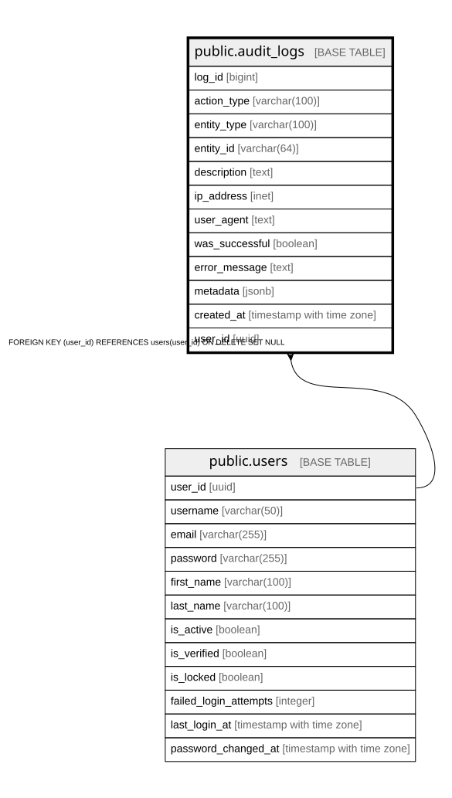

# public.audit_logs

## Columns

| Name | Type | Default | Nullable | Children | Parents | Comment |
| ---- | ---- | ------- | -------- | -------- | ------- | ------- |
| log_id | bigint |  | false |  |  |  |
| action_type | varchar(100) |  | false |  |  |  |
| entity_type | varchar(100) |  | true |  |  |  |
| entity_id | varchar(64) |  | true |  |  |  |
| description | text |  | true |  |  |  |
| ip_address | inet |  | true |  |  |  |
| user_agent | text |  | true |  |  |  |
| was_successful | boolean | true | false |  |  |  |
| error_message | text |  | true |  |  |  |
| metadata | jsonb |  | true |  |  |  |
| created_at | timestamp with time zone | now() | false |  |  |  |
| user_id | uuid |  | true |  | [public.users](public.users.md) |  |

## Constraints

| Name | Type | Definition |
| ---- | ---- | ---------- |
| audit_logs_user_id_fkey | FOREIGN KEY | FOREIGN KEY (user_id) REFERENCES users(user_id) ON DELETE SET NULL |
| audit_logs_pkey | PRIMARY KEY | PRIMARY KEY (log_id) |

## Indexes

| Name | Definition |
| ---- | ---------- |
| audit_logs_pkey | CREATE UNIQUE INDEX audit_logs_pkey ON public.audit_logs USING btree (log_id) |
| idx_audit_logs_user_id | CREATE INDEX idx_audit_logs_user_id ON public.audit_logs USING btree (user_id) |

## Relations

---

> Generated by [tbls](https://github.com/k1LoW/tbls)
