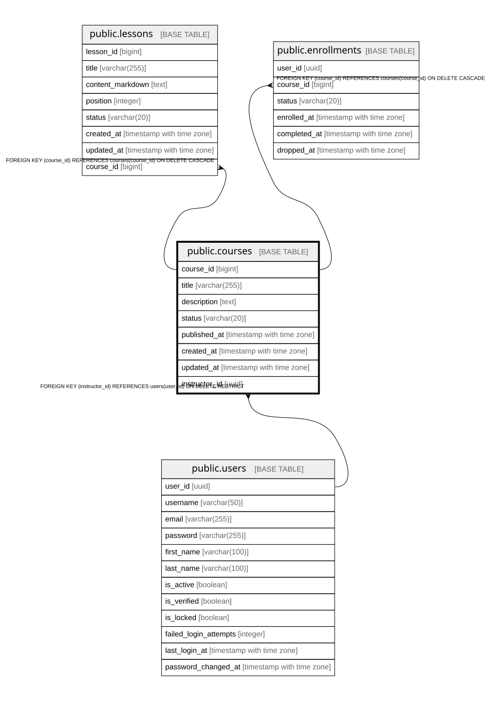

# public.courses

## Columns

| Name | Type | Default | Nullable | Children | Parents | Comment |
| ---- | ---- | ------- | -------- | -------- | ------- | ------- |
| course_id | bigint |  | false | [public.lessons](public.lessons.md) [public.enrollments](public.enrollments.md) |  |  |
| title | varchar(255) |  | false |  |  |  |
| description | text |  | true |  |  |  |
| status | varchar(20) | 'DRAFT'::character varying | false |  |  |  |
| published_at | timestamp with time zone |  | true |  |  |  |
| created_at | timestamp with time zone | now() | false |  |  |  |
| updated_at | timestamp with time zone | now() | false |  |  |  |
| instructor_id | uuid |  | false |  | [public.users](public.users.md) |  |

## Constraints

| Name | Type | Definition |
| ---- | ---- | ---------- |
| chk_courses_status | CHECK | CHECK (((status)::text = ANY ((ARRAY['DRAFT'::character varying, 'PUBLISHED'::character varying, 'ARCHIVED'::character varying])::text[]))) |
| courses_instructor_id_fkey | FOREIGN KEY | FOREIGN KEY (instructor_id) REFERENCES users(user_id) ON DELETE RESTRICT |
| courses_pkey | PRIMARY KEY | PRIMARY KEY (course_id) |

## Indexes

| Name | Definition |
| ---- | ---------- |
| courses_pkey | CREATE UNIQUE INDEX courses_pkey ON public.courses USING btree (course_id) |
| idx_courses_instructor_id | CREATE INDEX idx_courses_instructor_id ON public.courses USING btree (instructor_id) |

## Relations

---

> Generated by [tbls](https://github.com/k1LoW/tbls)
