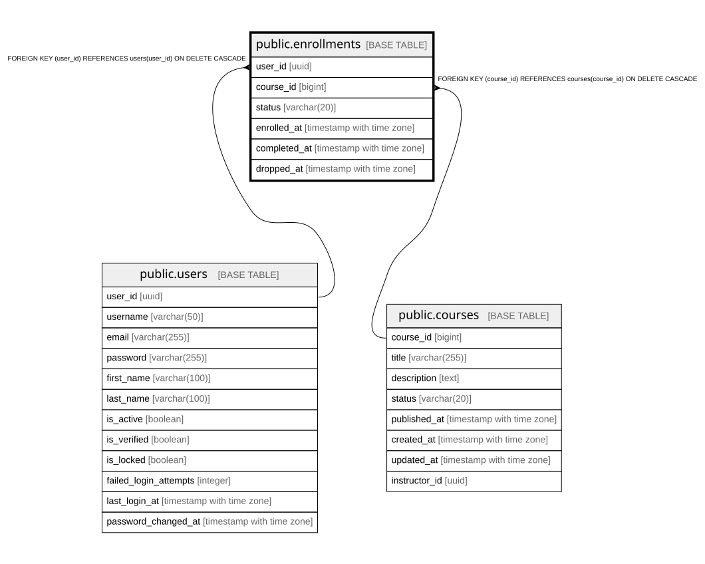

# public.enrollments

## Columns

| Name | Type | Default | Nullable | Children | Parents | Comment |
| ---- | ---- | ------- | -------- | -------- | ------- | ------- |
| user_id | uuid |  | false |  | [public.users](public.users.md) |  |
| course_id | bigint |  | false |  | [public.courses](public.courses.md) |  |
| status | varchar(20) | 'ENROLLED'::character varying | false |  |  |  |
| enrolled_at | timestamp with time zone | now() | false |  |  |  |
| completed_at | timestamp with time zone |  | true |  |  |  |
| dropped_at | timestamp with time zone |  | true |  |  |  |

## Constraints

| Name | Type | Definition |
| ---- | ---- | ---------- |
| chk_enrollments_status | CHECK | CHECK (((status)::text = ANY ((ARRAY['ENROLLED'::character varying, 'IN_PROGRESS'::character varying, 'COMPLETED'::character varying, 'DROPPED'::character varying])::text[]))) |
| enrollments_user_id_fkey | FOREIGN KEY | FOREIGN KEY (user_id) REFERENCES users(user_id) ON DELETE CASCADE |
| enrollments_course_id_fkey | FOREIGN KEY | FOREIGN KEY (course_id) REFERENCES courses(course_id) ON DELETE CASCADE |
| enrollments_pkey | PRIMARY KEY | PRIMARY KEY (user_id, course_id) |

## Indexes

| Name | Definition |
| ---- | ---------- |
| enrollments_pkey | CREATE UNIQUE INDEX enrollments_pkey ON public.enrollments USING btree (user_id, course_id) |
| idx_enrollments_course_id | CREATE INDEX idx_enrollments_course_id ON public.enrollments USING btree (course_id) |

## Relations

---

> Generated by [tbls](https://github.com/k1LoW/tbls)
