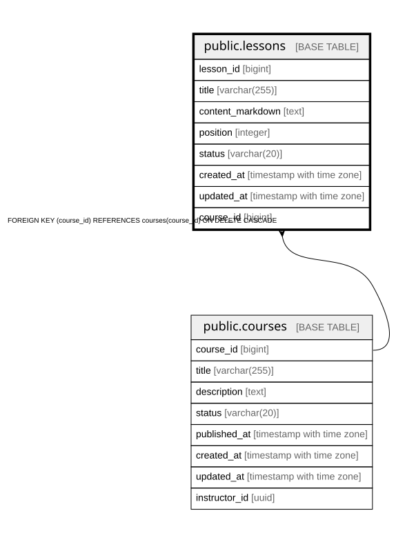

# public.lessons

## Columns

| Name | Type | Default | Nullable | Children | Parents | Comment |
| ---- | ---- | ------- | -------- | -------- | ------- | ------- |
| lesson_id | bigint |  | false |  |  |  |
| title | varchar(255) |  | false |  |  |  |
| content_markdown | text | ''::text | false |  |  |  |
| position | integer |  | false |  |  |  |
| status | varchar(20) | 'DRAFT'::character varying | false |  |  |  |
| created_at | timestamp with time zone | now() | false |  |  |  |
| updated_at | timestamp with time zone | now() | false |  |  |  |
| course_id | bigint |  | false |  | [public.courses](public.courses.md) |  |

## Constraints

| Name | Type | Definition |
| ---- | ---- | ---------- |
| chk_lessons_status | CHECK | CHECK (((status)::text = ANY ((ARRAY['DRAFT'::character varying, 'PUBLISHED'::character varying, 'ARCHIVED'::character varying])::text[]))) |
| lessons_course_id_fkey | FOREIGN KEY | FOREIGN KEY (course_id) REFERENCES courses(course_id) ON DELETE CASCADE |
| lessons_pkey | PRIMARY KEY | PRIMARY KEY (lesson_id) |
| uq_lessons_course_position | UNIQUE | UNIQUE (course_id, "position") |

## Indexes

| Name | Definition |
| ---- | ---------- |
| lessons_pkey | CREATE UNIQUE INDEX lessons_pkey ON public.lessons USING btree (lesson_id) |
| uq_lessons_course_position | CREATE UNIQUE INDEX uq_lessons_course_position ON public.lessons USING btree (course_id, "position") |

## Relations

---

> Generated by [tbls](https://github.com/k1LoW/tbls)
