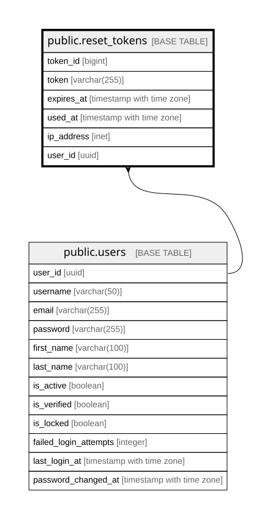

# public.reset_tokens

## Columns

| Name | Type | Default | Nullable | Children | Parents | Comment |
| ---- | ---- | ------- | -------- | -------- | ------- | ------- |
| token_id | bigint |  | false |  |  |  |
| token | varchar(255) |  | false |  |  |  |
| expires_at | timestamp with time zone |  | false |  |  |  |
| used_at | timestamp with time zone |  | true |  |  |  |
| ip_address | inet |  | true |  |  |  |
| user_id | uuid |  | false |  | [public.users](public.users.md) |  |

## Constraints

| Name | Type | Definition |
| ---- | ---- | ---------- |
| reset_tokens_user_id_fkey | FOREIGN KEY | FOREIGN KEY (user_id) REFERENCES users(user_id) ON DELETE CASCADE |
| reset_tokens_pkey | PRIMARY KEY | PRIMARY KEY (token_id) |
| reset_tokens_token_key | UNIQUE | UNIQUE (token) |

## Indexes

| Name | Definition |
| ---- | ---------- |
| reset_tokens_pkey | CREATE UNIQUE INDEX reset_tokens_pkey ON public.reset_tokens USING btree (token_id) |
| reset_tokens_token_key | CREATE UNIQUE INDEX reset_tokens_token_key ON public.reset_tokens USING btree (token) |
| idx_reset_tokens_user_id | CREATE INDEX idx_reset_tokens_user_id ON public.reset_tokens USING btree (user_id) |

## Relations

---

> Generated by [tbls](https://github.com/k1LoW/tbls)
