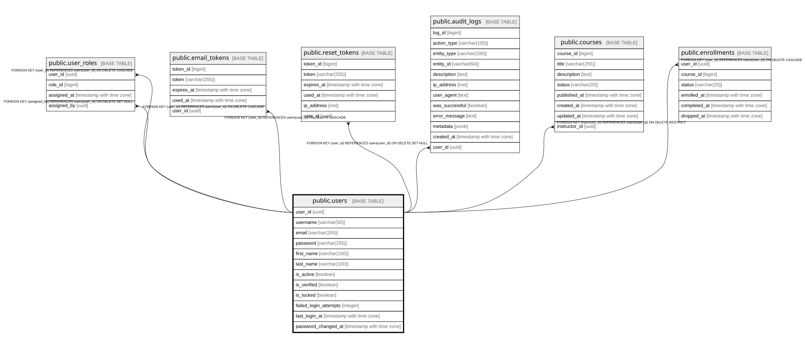

# public.users

## Columns

| Name | Type | Default | Nullable | Children | Parents | Comment |
| ---- | ---- | ------- | -------- | -------- | ------- | ------- |
| user_id | uuid | gen_random_uuid() | false | [public.user_roles](public.user_roles.md) [public.email_tokens](public.email_tokens.md) [public.reset_tokens](public.reset_tokens.md) [public.audit_logs](public.audit_logs.md) [public.courses](public.courses.md) [public.enrollments](public.enrollments.md) |  |  |
| username | varchar(50) |  | false |  |  |  |
| email | varchar(255) |  | false |  |  |  |
| password | varchar(255) |  | false |  |  |  |
| first_name | varchar(100) |  | true |  |  |  |
| last_name | varchar(100) |  | true |  |  |  |
| is_active | boolean | true | false |  |  |  |
| is_verified | boolean | false | false |  |  |  |
| is_locked | boolean | false | false |  |  |  |
| failed_login_attempts | integer | 0 | false |  |  |  |
| last_login_at | timestamp with time zone |  | true |  |  |  |
| password_changed_at | timestamp with time zone |  | true |  |  |  |

## Constraints

| Name | Type | Definition |
| ---- | ---- | ---------- |
| users_pkey | PRIMARY KEY | PRIMARY KEY (user_id) |
| users_username_key | UNIQUE | UNIQUE (username) |
| users_email_key | UNIQUE | UNIQUE (email) |

## Indexes

| Name | Definition |
| ---- | ---------- |
| users_pkey | CREATE UNIQUE INDEX users_pkey ON public.users USING btree (user_id) |
| users_username_key | CREATE UNIQUE INDEX users_username_key ON public.users USING btree (username) |
| users_email_key | CREATE UNIQUE INDEX users_email_key ON public.users USING btree (email) |

## Relations

---

> Generated by [tbls](https://github.com/k1LoW/tbls)
