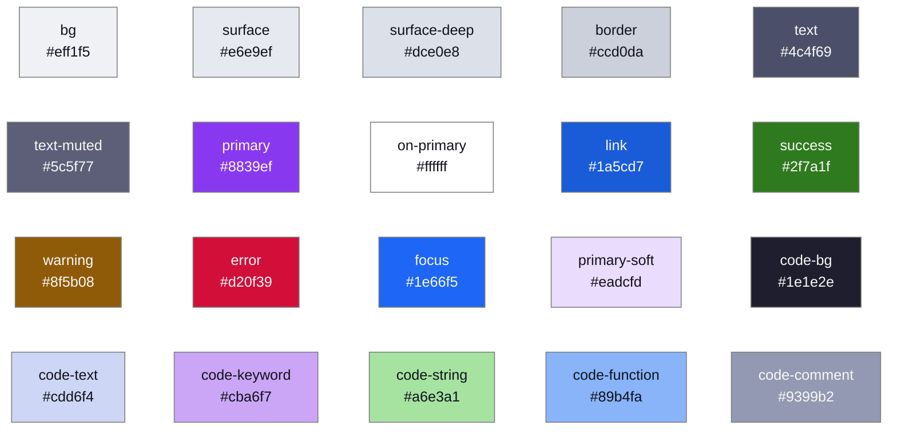
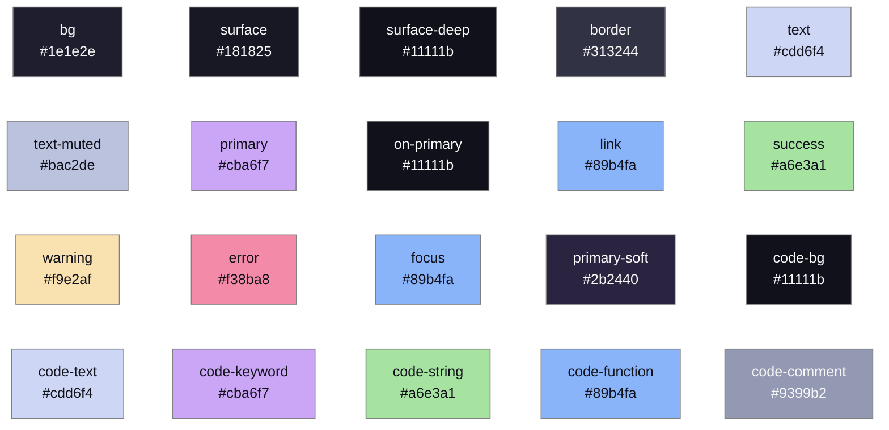
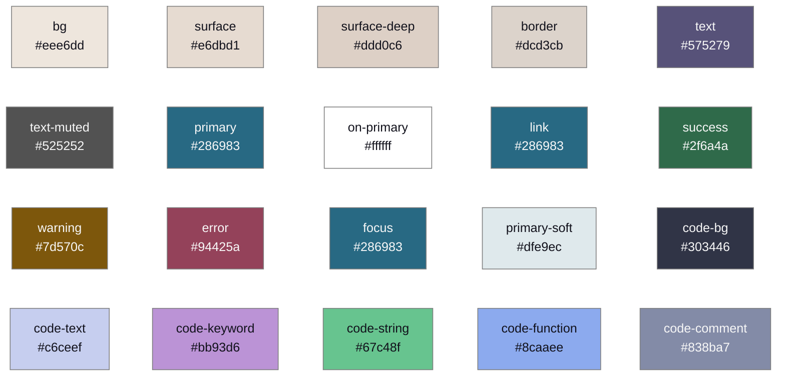
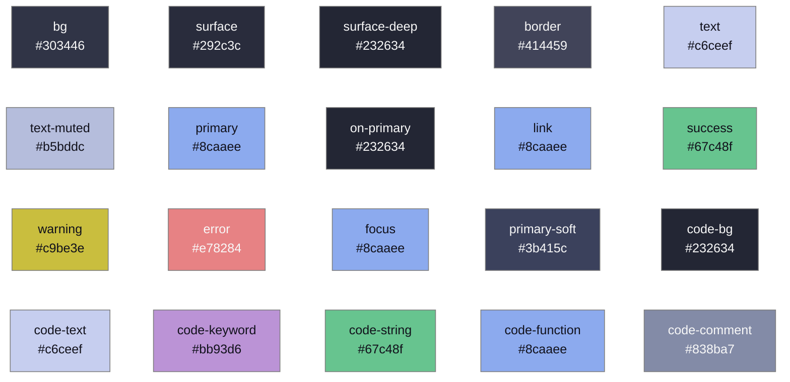

# Theme Exploration

Candidate visual themes for the learn-dev frontend, with design tokens and
WCAG-checked color pairs.

## Decision

- **Default theme: Catppuccin** (Catppuccin palette: Latte flavor in light
  mode, Mocha in dark mode).
- **Alternate: Soft Paper** (warm paper palette; its dark side is
  Catppuccin Frappe). Its stylesheet is generated and kept in the repo.
- **No runtime theme switching in v1** to keep things simple: both themes
  define the **same token names**, so switching means changing a single
  `<link>` element. Dark mode follows the OS preference
  (`prefers-color-scheme`), which is not a "switcher".

## Constraints

- **WCAG 2.1 AA / RGAA**: body text needs a contrast ratio of at least
  **4.5:1** against its background; large text and UI components need
  **3:1**. Every color pair below carries its computed ratio (see the
  Method appendix); values adjusted from the upstream palette to reach
  compliance are marked **(adjusted)**.
- Colors are consumed exclusively through **CSS custom properties (design
  tokens)**; BEM components never hardcode a color.
- Both light and dark variants are defined for each candidate.

## Candidate A (default): Catppuccin

Upstream palette: the official [Catppuccin palette](https://github.com/catppuccin/palette)
(Latte and Mocha flavors, MIT licensed). Initially considered through
AnuPpuccin, an Obsidian skin of Catppuccin (GPL-3.0); no AnuPpuccin code or
values are used, only the official Catppuccin palette, so the theme is named
after its real upstream. Pastel accents are designed for dark backgrounds,
so three light-mode values are darkened to pass 4.5:1.

| Token | Light (Latte) | Ratio on bg | Dark (Mocha) | Ratio on bg |
|---|---|---|---|---|
| `--color-bg` | `#eff1f5` (base) | | `#1e1e2e` (base) | |
| `--color-surface` | `#e6e9ef` (mantle) | | `#181825` (mantle) | |
| `--color-border` | `#ccd0da` (surface0) | | `#313244` (surface0) | |
| `--color-text` | `#4c4f69` (text) | 7.06:1 | `#cdd6f4` (text) | 11.34:1 |
| `--color-text-muted` | `#5c5f77` (subtext1) | 5.53:1 | `#bac2de` (subtext1) | 9.26:1 |
| `--color-primary` | `#8839ef` (mauve) | 4.79:1 | `#cba6f7` (mauve) | 8.07:1 |
| `--color-link` | `#1a5cd7` **(adjusted** from blue `#1e66f5`, 4.34:1**)** | 5.22:1 | `#89b4fa` (blue) | 7.79:1 |
| `--color-success` | `#2f7a1f` **(adjusted** from green `#40a02b`, 2.96:1**)** | 4.73:1 | `#a6e3a1` (green) | 11.03:1 |
| `--color-warning` | `#8f5b08` **(adjusted** from yellow `#df8e1d`, 2.31:1**)** | 5.06:1 | `#f9e2af` (yellow) | 12.91:1 |
| `--color-error` | `#d20f39` (red) | 4.80:1 | `#f38ba8` (red) | 7.08:1 |
| `--color-on-primary` (button text) | `#ffffff` | 5.41:1 on primary | `#11111b` (crust) | 9.23:1 on primary |
| `--color-focus` | `#1e66f5` (blue, 3:1 UI requirement) | | `#89b4fa` (blue) | |

Character: fresh, slightly playful pastels; the mauve primary gives the
learning platform a distinctive identity without feeling corporate.

## Candidate B (alternate): Soft Paper

Upstream: [nickmilo/soft-paper](https://github.com/nickmilo/soft-paper)
(Obsidian theme). Interesting finding: Soft Paper is itself built on
Catppuccin variables; its light palette is a custom warm paper set and its
dark palette is essentially **Catppuccin Frappe**. Three light-mode
semantic colors are darkened to pass 4.5:1.

| Token | Light (paper) | Ratio on bg | Dark (Frappe) | Ratio on bg |
|---|---|---|---|---|
| `--color-bg` | `#eee6dd` | | `#303446` | |
| `--color-surface` | `#e6dbd1` | | `#292c3c` | |
| `--color-border` | `#dcd3cb` | | `#414459` | |
| `--color-text` | `#575279` | 5.89:1 | `#c6ceef` | 7.90:1 |
| `--color-text-muted` | `#525252` | 6.32:1 | `#b5bddc` | 6.61:1 |
| `--color-primary` | `#286983` | 4.94:1 | `#8caaee` | 5.34:1 |
| `--color-link` | `#286983` | 4.94:1 | `#8caaee` | 5.34:1 |
| `--color-success` | `#2f6a4a` **(adjusted** from `#3f7d5b`, 3.96:1**)** | 5.18:1 | `#67c48f` | 5.79:1 |
| `--color-warning` | `#7d570c` **(adjusted** from `#96690f`, 3.93:1**)** | 5.25:1 | `#c9be3e` | 6.40:1 |
| `--color-error` | `#94425a` **(adjusted** from `#a34e63`, 4.44:1**)** | 5.34:1 | `#e78284` | 4.65:1 |
| `--color-on-primary` (button text) | `#ffffff` | 6.11:1 on primary | `#232634` (crust) | 6.51:1 on primary |
| `--color-focus` | `#286983` | | `#8caaee` | |

Character: calm, warm, reflective; reads like paper. Lower-key than
Catppuccin, closer to a reading environment than an interactive app.

## Color palettes

<!-- Generated by scripts/generate_palette_diagrams.py from the
     theme stylesheets. Regenerate after any token change. -->

Every swatch below comes straight from the theme stylesheets;
GitHub renders these Mermaid blocks with the real colors, so no
image is committed. Values are the shipped (contrast-adjusted)
tokens, not the upstream palettes.

### Catppuccin Latte (light)

### Catppuccin Mocha (dark)

### Soft Paper light

### Soft Paper dark

## Structural tokens (theme-independent)

Defined once in `base.css`, identical for both themes:

| Group | Tokens |
|---|---|
| Typography | `--font-body`: system-ui stack; `--font-size-{sm,base,lg,xl,2xl}`: 0.875 / 1 / 1.125 / 1.375 / 1.75 rem; `--line-height`: 1.6 |
| Spacing | `--space-{1..6}`: 0.25 / 0.5 / 1 / 1.5 / 2 / 3 rem |
| Shape | `--radius-sm`: 4px; `--radius`: 8px; `--shadow`: soft single-layer |
| Focus | 2px solid `--color-focus` outline with 2px offset, never removed |

## How the tokens are consumed

- Each theme is one stylesheet defining the same custom property names on
  `:root` (light values) and inside `@media (prefers-color-scheme: dark)`
  (dark values).
- `base.css` holds resets, typography, and all BEM components
  (`.site-header`, `.form__field`, `.button--primary`, `.alert--error`, ...)
  written only against token names.
- The active theme is the one `<link>` in the page head:
  `css/theme-catppuccin.css` (default). Switching to Soft Paper = replacing
  that one href with `css/theme-soft-paper.css`.

## Appendix: method

Ratios computed with the WCAG 2.x relative-luminance formula
(`(L1 + 0.05) / (L2 + 0.05)` over linearized sRGB), by a Python script run
against the upstream palettes fetched from their repositories. Thresholds:
4.5:1 for normal text, 3:1 for large text and UI components. All values in
the tables above are script outputs, not estimates.
